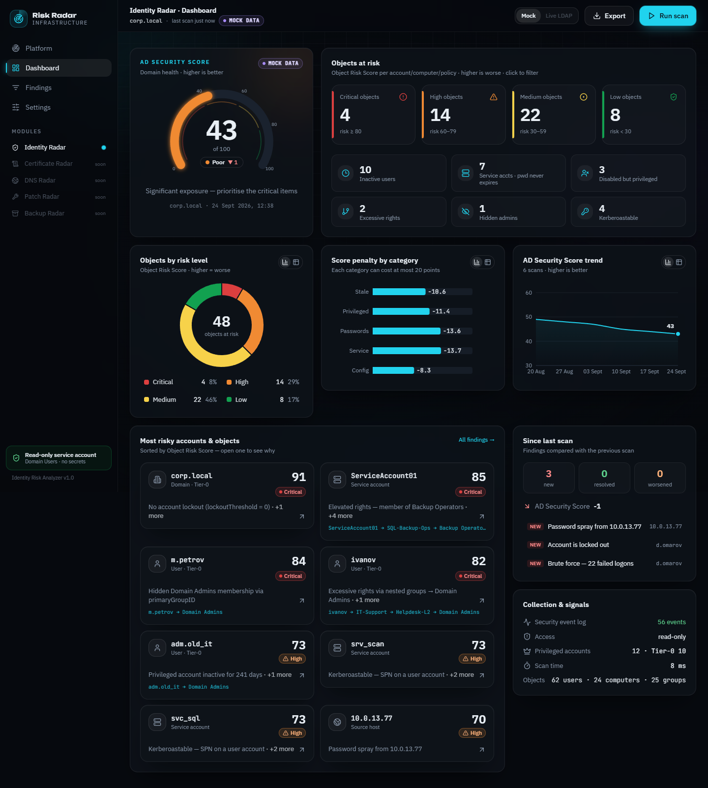
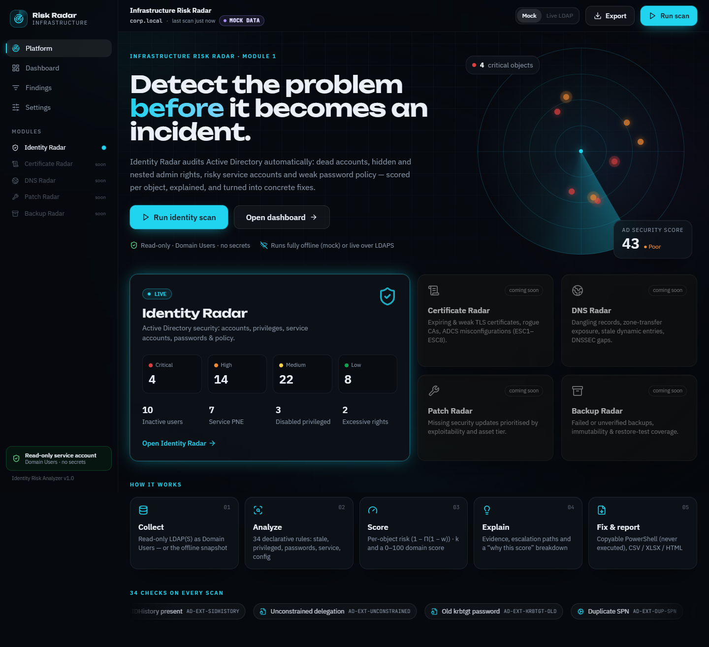
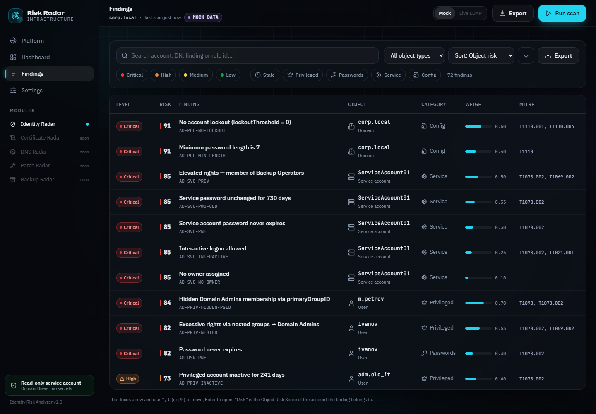
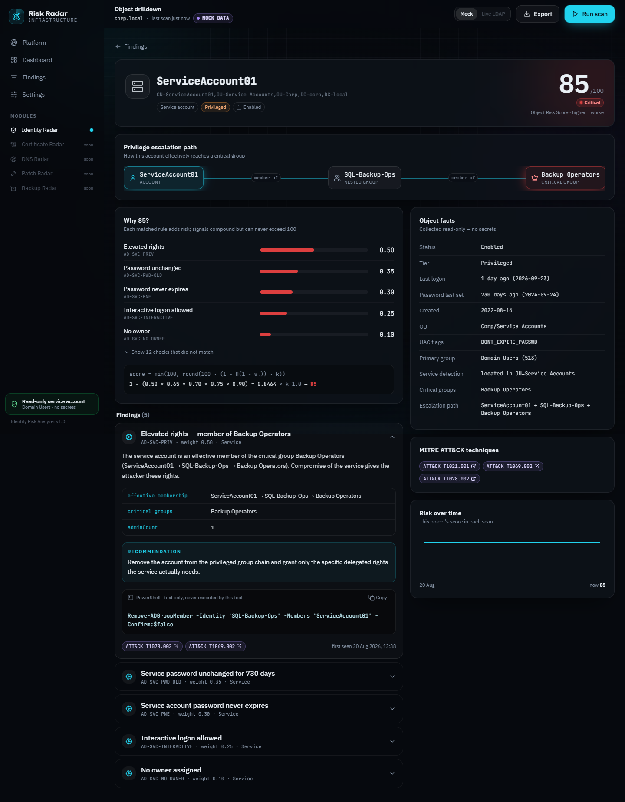
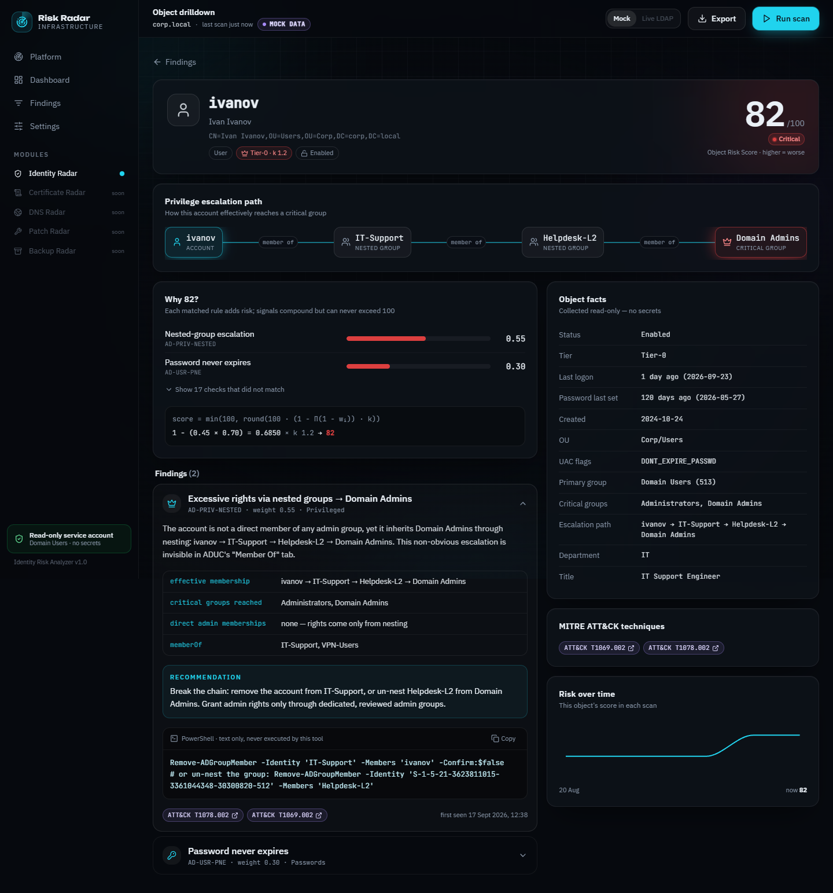
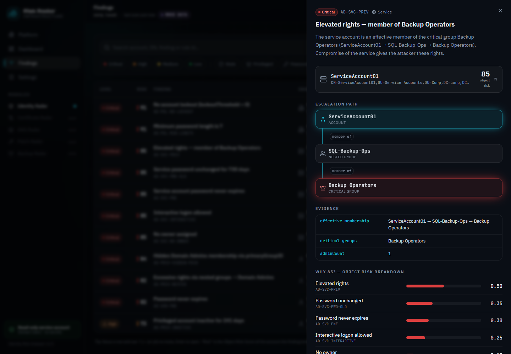
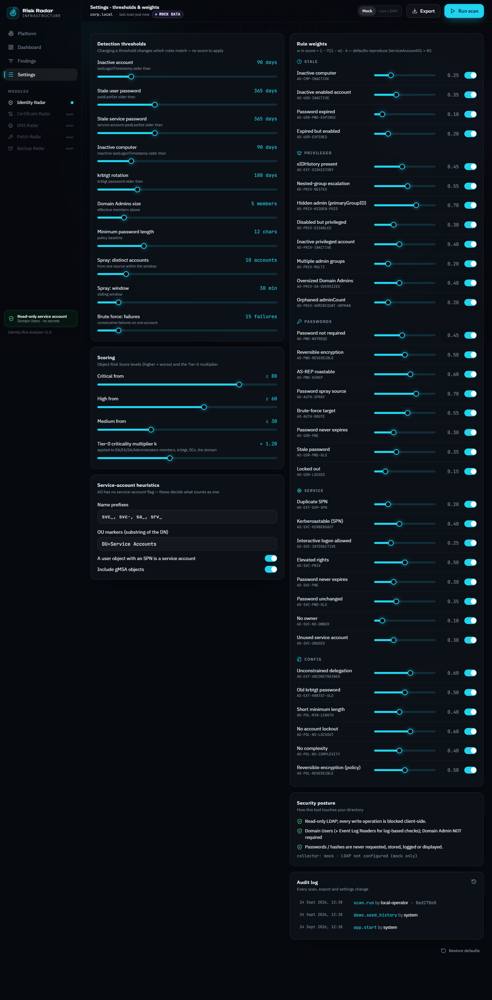

# Identity Risk Analyzer — Active Directory Security Radar

**Detect the problem before it becomes an incident.** Identity Risk Analyzer audits a Microsoft Active Directory
domain automatically: it collects directory objects **read-only**, runs 34 declarative rules, scores the risk of
every object, rolls it up into a 0–100 **AD Security Score**, explains *why* each score is what it is, and
recommends concrete fixes (copyable PowerShell, never executed) — with CSV / XLSX / HTML export.

It is **Module 1 of *Infrastructure Risk Radar***: a shared core (Finding model, risk engine, storage, API, UI
shell) with Active Directory as the first collector set. Certificate, DNS, Patch and Backup radars plug into the
same contracts later.



---

## Quick start (offline demo — no Active Directory needed)

Requirements: Python 3.11+ and Node 20+.

```bash
# 1) backend
cd backend
python -m venv .venv
.venv/Scripts/activate            # Windows  (Linux/macOS: source .venv/bin/activate)
pip install -r requirements.txt
python ../scripts/generate_mock.py   # optional: the dataset is already checked in
uvicorn app.main:app --reload        # API on http://127.0.0.1:8000  (OpenAPI docs: /docs)

# 2) frontend (second terminal)
cd frontend
npm install
npm run dev                          # UI on http://localhost:5173 (proxies /api to :8000)
```

**Single-process demo mode** (best for a stage laptop): `cd frontend && npm run build`, then start only the
backend — FastAPI serves the built UI at **http://127.0.0.1:8000**. No Node needed at demo time, no network needed.

**Docker** (optional): `docker compose up --build` → UI on http://localhost:8080, API on :8000.
*(The compose file and Dockerfiles are provided but were not exercised in the development environment, which had
no Docker.)*

On first start in mock mode the app seeds five simulated earlier states of the demo domain (labelled
*demo history* in the UI) so the trend chart and the “since last scan” diff have something to show. Press
**Run scan** to create a real scan.

---

## What it checks

| Area (spec) | Checks | Rule IDs |
|---|---|---|
| **Users** (2.3.1) | enabled but inactive (`lastLogonTimestamp`, never-logged-on via `whenCreated`), password never expires, stale password, locked out, password expired, expired-but-enabled | `AD-USR-*` |
| **Service accounts** (2.3.2) | detection by SPN / name prefix / OU / gMSA; Kerberoastable (T1558.003), interactive logon allowed (`userWorkstations` + 4624 type 2/10), elevated rights, PNE, old password, no owner, unused | `AD-SVC-*` |
| **Privileges** (2.3.3) | **nested-group escalation with the full path**, **hidden admins via `primaryGroupID`**, disabled-but-privileged, inactive privileged, multiple admin groups, oversized Domain Admins, orphaned `adminCount` | `AD-PRIV-*` |
| **Passwords & auth** (2.3.4) | domain policy (`minPwdLength`, `lockoutThreshold=0`, complexity, reversible), fine-grained PSOs, `PASSWD_NOTREQD`, reversible encryption, AS-REP roasting (T1558.004), **password spray** (T1110.003) and **brute force** from the Security log | `AD-POL-*`, `AD-PWD-*`, `AD-AUTH-*` |
| **Extra** (2.3.5) | inactive computers, `sIDHistory`, unconstrained delegation on non-DCs, `krbtgt` password age, duplicate SPNs | `AD-CMP-*`, `AD-EXT-*` |

Rules are declarative YAML (`backend/app/rules/*.yaml`) with weight, category, MITRE ATT&CK ids, description,
recommendation and a PowerShell remediation template. Weights and thresholds are tunable in the UI (**Settings**)
and re-scoring is one click.

Critical groups are resolved **by SID/RID**, never by name — so a Russian-locale DC where Domain Admins is called
«Администраторы домена» works identically (covered by a test). Nested membership is resolved both by walking the
group graph (to produce the escalation path) and by `LDAP_MATCHING_RULE_IN_CHAIN` (1.2.840.113556.1.4.1941) as a
cross-check; `LDAP_IN_CHAIN` does not follow `primaryGroupID`, which is exactly why the hidden-admin check exists.

---

## Risk model

Two scores, deliberately labelled differently everywhere in the UI:

| Score | Range | Direction | Meaning |
|---|---|---|---|
| **Object Risk Score** | 0–100 | higher = **worse** | risk of one account / computer / policy |
| **AD Security Score** | 0–100 | higher = **better** | health of the whole domain |

**Per object** — probabilistic OR, so signals compound but never exceed 100:

```
score = min(100, round(100 · (1 − Π(1 − wᵢ)) · k))        k = 1.2 for Tier-0 objects, else 1.0
```

Levels: Critical ≥ 80, High 60–79, Medium 30–59, Low < 30 (configurable).

**Worked example (spec) — ServiceAccount01 = 85, Critical.** Password never expires 0.30, password unchanged
730 days 0.35, elevated rights 0.50, no owner 0.10, interactive logon allowed 0.25, k = 1.0:
`1 − (0.70 × 0.65 × 0.50 × 0.90 × 0.75) = 0.8464 → 85`. The UI shows exactly this in the **“Why 85?”** panel, and
`tests/test_risk_engine.py` asserts it (with both the literal weights and the YAML weights). The same engine
reproduces the Certificate Radar example (0.75 × k 1.2 = 90), proving it is module-agnostic.

*Tier-0* (k = 1.2) = effective members of Domain/Enterprise/Schema Admins or BUILTIN\Administrators, the RID-500
Administrator, `krbtgt`, domain controllers and the domain object itself. Operator groups (Account/Server/Backup
Operators, DnsAdmins) count as *privileged* (“elevated rights”) but are not k-amplified — that is why
ServiceAccount01 (member of Backup Operators via `SQL-Backup-Ops`) lands on exactly 85.

**AD Security Score** = 100 − Σ category penalties (Stale, Privileged, Passwords, Service, Config). Each penalty
grows smoothly with the count *and* severity of its findings, `20 · (1 − e^(−Σ wᵢkᵢ / τ))`, and is capped at 20, so
no single category can zero the domain.

---

## Demo dataset (offline mode)

`scripts/generate_mock.py` deterministically builds `backend/data/mock_ad.json` — a realistic `corp.local` with 62
users, 24 computers, 25 groups, 2 PSOs and a 24-hour Security-log excerpt. Analysis yields **exactly** the spec's
numbers (asserted in `tests/test_analyzers.py`):

| Indicator | Value |
|---|---|
| Inactive users | **10** |
| Service accounts with Password Never Expires | **7** |
| Disabled privileged accounts | **3** |
| Users with excessive rights via nested groups | **2** (`ivanov → IT-Support → Helpdesk-L2 → Domain Admins`, `s.kuznetsova → Deploy-Operators → Server-Admins → Administrators`) |
| ServiceAccount01 | **85 / Critical** |
| Hidden Domain Admin via `primaryGroupID=512` | **1** (`m.petrov`) |
| AS-REP roastable | **1** · `lockoutThreshold = 0` · password spray from 10.0.13.77 · brute force on `d.omarov` |

The mock collector returns the **same normalized snapshot** the LDAP collector emits (raw UAC ints, FILETIMEs,
SID strings, DN lists) and rebases timestamps to “now”, so the numbers never drift. A parity test loads the demo
domain into an in-memory LDAP server (ldap3 `MOCK_SYNC`) in raw wire format, runs the **real** `LdapCollector`
against it and asserts that the snapshot and the whole analysis are identical to mock mode.

---

## Live mode (real Active Directory)

1. Create a least-privilege reader — a plain **Domain Users** account; Domain Admin is **not** required:
   ```powershell
   New-ADUser svc_ira_reader -UserPrincipalName svc_ira_reader@corp.local -AccountPassword (Read-Host -AsSecureString) -Enabled $true
   # Optional, only for spray/brute-force checks: add it to "Event Log Readers" on the DCs.
   ```
2. Copy `.env.example` to `.env` and set:
   ```ini
   SOURCE=ldap
   LDAP_SERVER=dc01.corp.local
   LDAP_USE_SSL=true            # LDAPS 636 (or LDAP_START_TLS=true on 389)
   LDAP_CA_CERT=/path/corp-root-ca.pem
   LDAP_BIND_USER=svc_ira_reader@corp.local
   LDAP_BIND_PASSWORD=...
   ```
3. Restart the backend; the **Mock / Live LDAP** toggle in the top bar becomes available.

Security-log signals: `EVENTLOG_MODE=wevtutil` (+ `EVENTLOG_DC`) on a Windows host, or export with
`scripts/export_auth_events.ps1` and use `EVENTLOG_MODE=file`. Without logs these checks are skipped and the UI says
so — nothing else is affected.

**Lab domain:** `scripts/seed_lab_ad.ps1 -IAcknowledgeLabOnly` builds the same objects in a disposable Windows
Server 2019+ lab (it refuses to run on a directory with more than 300 users). `pwdLastSet` / `lastLogonTimestamp`
cannot be back-dated through LDAP; see the script header for the `ANALYSIS_DATE` / clock-shift options.

**Offline replay:** every scan stores its (secret-free) snapshot. Download it from *Export → Raw snapshot* and
replay anywhere with `SOURCE=snapshot SNAPSHOT_PATH=...`, or `POST /api/scan {"source":"snapshot","replay_scan_id":...}`.
If the demo VM dies on stage, the saved live snapshot renders an identical dashboard.

---

## Security (spec 4.2)

- **Read-only.** ldap3 `read_only=True` does not cover `add()`, so the collector uses its own `ReadOnlyConnection`
  that blocks add/modify/delete/modify_dn (tested). Recommendations are text; nothing is ever executed.
- **Least privilege.** Works as a plain Domain Users member (+ Event Log Readers for log checks). PSOs are only
  readable by admins by default — the tool degrades gracefully and says so.
- **No passwords or hashes.** Attributes are requested from an explicit allow-list (never `*`); a deny-list
  (`unicodePwd`, `ms-Mcs-AdmPwd`, `msLAPS-*`, `msDS-ManagedPassword`, `supplementalCredentials`, … and
  `description`, where admins often paste passwords) is enforced again on every snapshot. Replication-based hash
  auditing (DSInternals) is intentionally not implemented. Tests poison the directory with secrets and assert they
  never reach the snapshot, and assert the bind password never reaches API responses or the database file.
- **Credentials** only from environment / `.env`, held as `SecretStr`, never logged, stored or returned.
  LDAPS / StartTLS with certificate validation; a warning is recorded if validation is disabled.
- **Audit log** of every action: app start, scans (incl. failures), exports, snapshot downloads, settings changes
  (`GET /api/audit`, shown in Settings). The actor comes from the `X-Actor` header (no auth in the MVP).
- **Output safety.** CSV/XLSX exports neutralise formula injection from directory-controlled strings; the HTML
  report is Jinja2-autoescaped, self-contained and makes no external requests.

---

## API

OpenAPI docs at **`/docs`**. `latest` is accepted wherever a scan id is expected.

| Method | Path | Purpose |
|---|---|---|
| POST | `/api/scan` `{source, replay_scan_id?, wait?}` | collect → analyze → score → persist; returns `scan_id` (`wait:false` returns a job) |
| GET | `/api/scan/jobs/{job_id}` | real stage progress: collecting → analyzing → scoring → persisting → done |
| GET | `/api/scans` · `/api/scans/{id}` | history · full `ScanResult` |
| GET | `/api/scans/{id}/diff?against=` | new / resolved / worsened / improved findings |
| GET | `/api/scans/{id}/snapshot` | raw secret-free snapshot for offline replay |
| POST | `/api/scans/{id}/rescore` | re-analyze the stored snapshot with current settings |
| GET | `/api/dashboard/{id}` | gauge, counters, category matrix, top-risk objects, trend, diff |
| GET | `/api/findings?scan_id=&level=&category=&object_type=&rule_id=&q=&sort=&order=` | filter / sort (comma lists allowed) |
| GET | `/api/findings/{finding_id}` · `/api/accounts/{object_id}` | finding detail · per-object drilldown with history |
| GET | `/api/export/{id}?format=csv\|xlsx\|html` (+ findings filters) | file download |
| GET/PUT | `/api/settings` (`?rescore=true`) · POST `/api/settings/reset` | thresholds, level cutoffs, heuristics, rule weights |
| GET | `/api/rules` · `/api/audit` · `/api/health` | rule catalogue · audit log · safe config summary |

---

## Architecture

```
collectors/            analyzers/ (identity module)        core/ (shared by every Radar module)
  mock_collector  ─┐     context.py  (graph, RID resolution)   models.py      Finding / Entity / ScanResult
  ldap_collector  ─┼──▶  user / service / privilege /   ──▶    risk_engine.py (pure, unit-tested)
  snapshot replay ─┘     password / extra analyzers            pipeline.py    rules → findings → scores
  eventlog_collector     rules/*.yaml (34 rules)               rules_loader.py
        │                                                              │
        └── normalized snapshot (identical in every mode) ──▶ storage/ (SQLite: scans, findings,
                                                               snapshots, audit_log, app_settings)
                                                                       │
                                               api/ (FastAPI) ◀────────┘ ──▶ exporters/ (CSV, XLSX, HTML)
                                                     │
                                  frontend/ React 18 + TS + Vite + Tailwind + shadcn/ui + motion + Recharts
```

Frontend: dark security-operations console; 21st.dev-style pieces (aurora background, bento module grid,
spotlight/tilt cards, marquee, animated counters) are hand-built with Tailwind + motion because the 21st.dev
registry was not reachable from the build environment. Charts follow a data-viz discipline: risk-level colors were
validated for colour-vision deficiency on the actual dark surface and are always paired with a text label; every
chart has a table view; `prefers-reduced-motion` is respected.

---

## Tests

```bash
cd backend && .venv/Scripts/python -m pytest -q
cd frontend && npm run typecheck && npm run build
```

`test_risk_engine.py` (ServiceAccount01 = 85, bounds, levels, domain score caps) · `test_analyzers.py` (exact demo
numbers, every rule fires, escalation paths, hidden admin, Russian-locale DC, group cycles, IN_CHAIN fallback,
thresholds, no-logs degradation) · `test_collectors.py` (FILETIME/SID/GeneralizedTime converters, secret
sanitising, rebase, replay) · `test_ldap_parity.py` (real LdapCollector vs mock, read-only guard, wevtutil XML) ·
`test_api.py` (every endpoint, async job stages, history/diff, settings → re-score, audit log, bind-password leak
check) · `test_exports.py` (files open, formatting, injection).

---

## Screenshots

| | |
|---|---|
|  |  |
|  |  |
|  |  |

---

## Known limitations / next steps

- No user authentication in the MVP (single operator; the audit actor comes from `X-Actor`). `# TODO(P2)`: SSO.
- `sIDHistory` cannot be reproduced by the lab seeding script (needs migration tooling); it is covered by the mock.
- Live LDAP mode was verified against an in-memory LDAP server with the demo domain in wire format, not against a
  physical DC in this environment.
- Next: admin notifications (email/Telegram), light theme, and the sibling Radar modules.
